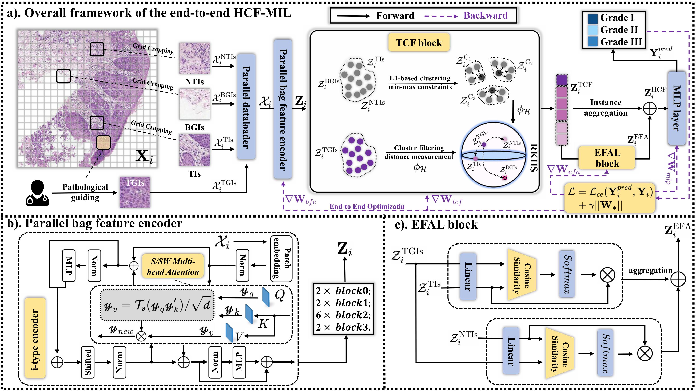

# An End-to-end Knowledge-driven Multi-instance Learning Network with Hierarchical Cluster-incorporated Aware Filtering for Larynx Pathological Grading 

## :fire: News

- [2025/04/25] Our manuscript has been submitted to IEEE Transactions on Medical Imaging. 


## :rocket: Pipeline

Here's an overview of our **Hierarchical Cluster-incorporated Aware Filtering (HCF-MIL)** method:




## :mag: TODO
<font color="red">**We are currently organizing all the code. Stay tuned!**</font>
- [x] training code
- [x] Evaluation code
- [x] Model code
- [ ] Pretrained weights
- [ ] Datasets


## 🛠️ Getting Started

To get started with NCFM, follow the installation instructions below.

1.  Clone the repo

```sh
git clone https://github.com/gszfwsb/NCFM.git
```

2. Install dependencies
   
```sh
pip install -r requirements.txt
```

3. Training
```sh
cd pretrain
torchrun --nproc_per_node={n_gpus} --nnodes=1 pretrain_script.py --gpu={gpu_ids} --config_path=../config/{ipc}/{dataset}.yaml

```

4. Evaluation
```sh
cd evaluation 
torchrun --nproc_per_node={n_gpus} --nnodes=1 evaluation_script.py --gpu={gpu_ids} --ipc={ipc} --config_path=../config/{ipc}/{dataset}.yaml --load_path={distilled_dataset.pt}
```

## :postbox: Contact
If you have any questions, please contact [Chentao Li](https://prince-lee-pathai.github.io/) (`cl4691@columbia.edu`).
